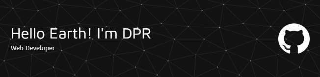

<h2 align="left">Hello there 👋, I'm Dani</h2>

###

  

###

  
  
  

###

<h4 align="left">👩‍💻  About Me</h4>

###

- 🔭 I’m working as Backend Developer - 📚 I'm currently learning Ruby - ⚡ In my free time I sleep

###

<h3 align="left">🛠 Language and tools</h3>

###

  
  
  
  
  
  
  
  
  
  
  
  
  
  
  
  
  
  
  
  
  

###

###

  
  

###

<h4 align="left">😎 Lets Goo!!</h4>

###

<picture>
  <source media="(prefers-color-scheme: dark)" srcset="https://raw.githubusercontent.com/DPR-art/DPR-art/output/pacman-contribution-graph-dark.svg">
  <source media="(prefers-color-scheme: light)" srcset="https://raw.githubusercontent.com/DPR-art/DPR-art/output/pacman-contribution-graph.svg">
  
</picture>

###

<h4 align="left">🎵 Hear Music With Me</h4>

###

